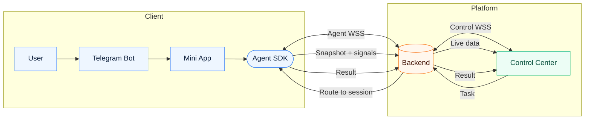

# telegram-giphy-bot
This public repo holds the code for Telegram Bot created in Go - this bot returns Gifs based on user search. Will also be testing Mini Apps for payment inside this.

```mermaid
flowchart LR

%% --- Groups ---
    subgraph Client
        U[User]
        TB[Telegram Bot]
        MA[Mini App]
        SDK([Agent SDK])
        U --> TB --> MA --> SDK
    end

    subgraph Platform
        BE[(Backend)]
        CC[Control Center]
    end

%% --- Persistent channels ---
    SDK <-->|Agent WSS| BE
    BE <-->|Control WSS| CC

%% --- Telemetry path ---
    SDK -->|Snapshot + signals| BE -->|Live data| CC

%% --- Task path ---
    CC -->|Task| BE -->|Route to session| SDK
    SDK -->|Result| BE -->|Result| CC

%% --- Styles (kept simple and renderer-safe) ---
    classDef client fill:#eef6ff,stroke:#3b82f6,color:#0b1d3a;
    classDef server fill:#fff7ed,stroke:#f97316,color:#431407;
    classDef control fill:#ecfdf5,stroke:#10b981,color:#064e3b;

    class U,TB,MA,SDK client;
    class BE server;
    class CC control;


```